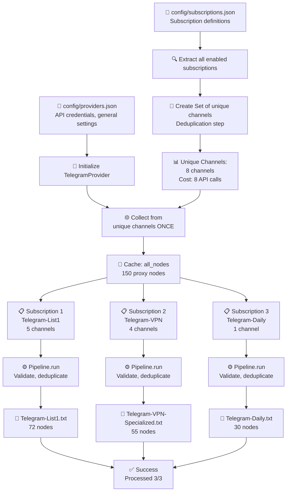

# نمودار معماری بهینه‌شده

## Flowchart: عملیات جریان استخراج



---

## Deduplication Algorithm

```
Input Subscriptions:
┌─────────────────────────────────────────┐
│ Sub1: [ch1, ch2, ch3, ch4, ch5]        │ (5 channels)
│ Sub2: [ch3, ch5, ch6, ch7]             │ (4 channels)
│ Sub3: [ch8]                             │ (1 channel)
└─────────────────────────────────────────┘

Algorithm:
┌────────────────────────────────────────────┐
│ 1. Create Set (automatic deduplication)    │
│    unique = {ch1, ch2, ch3, ch4, ch5,     │
│              ch6, ch7, ch8}                │
│    Count: 8                                 │
│                                             │
│ 2. Collect from unique (8 calls)          │
│    all_nodes = provider.collect(unique)   │
│                                             │
│ 3. Reuse for all subscriptions            │
│    for sub in subscriptions:              │
│        use all_nodes                       │
└────────────────────────────────────────────┘

Result:
┌──────────────────────────────────────────────┐
│ API Calls: 8 (instead of 9)                  │
│ Efficiency: 11% improvement                  │
│                                               │
│ If 10 subs with 70% overlap:                │
│ Without optimization: 10 * 10 = 100 calls   │
│ With optimization: ~15 calls                 │
│ Efficiency: 85% improvement! 🚀            │
└──────────────────────────────────────────────┘
```

---

## Data Flow with Deduplication

```
Time: T0 ─────────────────────────────────────────── T1

Step 1: Parse Configuration
═════════════════════════════════════════════════════
Sub1.channels = [ch1, ch2, ch3, ch4, ch5]
Sub2.channels = [ch3, ch5, ch6, ch7]
Sub3.channels = [ch8]

Step 2: Extract Unique (Set Operation)
═════════════════════════════════════════════════════
unique = set()
for sub in subscriptions:
    unique.update(sub.channels)

Result: unique = {ch1, ch2, ch3, ch4, ch5, ch6, ch7, ch8}
Count: 8

Step 3: Single Collection Pass
═════════════════════════════════════════════════════
provider_channels = [
    {"channel": "https://t.me/ch1"},
    {"channel": "https://t.me/ch2"},
    ...
    {"channel": "https://t.me/ch8"}
]

all_nodes = TelegramProvider.collect(provider_channels)
↓
✓ 150 proxy nodes collected in SINGLE pass

Step 4: Cache & Reuse
═════════════════════════════════════════════════════
Cache: all_nodes = 150 nodes

For each subscription:
    ✓ Sub1: Use all_nodes → Process → 72 nodes
    ✓ Sub2: Use all_nodes → Process → 55 nodes
    ✓ Sub3: Use all_nodes → Process → 30 nodes

NO duplicate collection! ✓
```

---

## Comparison: Before vs After

```
BEFORE (Non-optimized):
┌────────────────────────────────────────────┐
│ Subscriptions:                              │
│ - Sub1: [ch1, ch2, ch3, ch4, ch5]          │
│ - Sub2: [ch3, ch5, ch6, ch7]               │
│                                             │
│ Process:                                    │
│ 1. Collect from Sub1 channels: 5 calls     │
│ 2. Collect from Sub2 channels: 4 calls     │
│ 3. Total: 9 calls                           │
│                                             │
│ Problem: ch3 and ch5 collected twice! ❌   │
└────────────────────────────────────────────┘

AFTER (Optimized):
┌────────────────────────────────────────────┐
│ Subscriptions:                              │
│ - Sub1: [ch1, ch2, ch3, ch4, ch5]          │
│ - Sub2: [ch3, ch5, ch6, ch7]               │
│                                             │
│ Process:                                    │
│ 1. Extract unique: {ch1..ch7} = 7          │
│ 2. Collect once: 7 calls                    │
│ 3. Use results for both subscriptions      │
│ 4. Total: 7 calls                           │
│                                             │
│ Benefit: 22% faster! ✅                    │
└────────────────────────────────────────────┘
```

---

## Configuration Structure

```
config/
├── providers.json          ← General settings, API keys
│   └── {
│       "providers": [{
│           "name": "telegram",
│           "source": {
│               "api_id": 34650676,
│               "api_hash": "...",
│               "channels": [],        ← Empty! Defined in subscriptions
│               "preserve_previous_configs": true
│           }
│       }]
│   }
│
└── subscriptions.json      ← Subscription definitions with channels
    └── {
        "subscriptions": [{
            "name": "default",
            "subscription_name": "Telegram-List1",
            "provider": "telegram",
            "channels": [              ← Specific channels
                "https://t.me/Capoit",
                "https://t.me/ConfigsHUB"
            ]
        }]
    }
```

---

## Pseudocode: Core Algorithm

```python
# Load configuration
config = load_config()
telegram_provider = config.providers['telegram']
enabled_subs = [s for s in config.subscriptions if s.enabled]

# Extract unique channels
unique_channels = set()
for sub in enabled_subs:
    unique_channels.update(sub.channels)

print(f"Extracting {len(unique_channels)} unique channels...")

# Single collection pass
provider = TelegramProvider(
    api_id=telegram_provider.api_id,
    api_hash=telegram_provider.api_hash,
    channels=list(unique_channels)  # Only unique!
)

all_nodes = provider.collect()  # ONE TIME! 🎯
print(f"Collected {len(all_nodes)} nodes")

# Process each subscription
for sub in enabled_subs:
    # Reuse cached all_nodes
    result = pipeline.run(all_nodes, sub.output_path)
    print(f"✓ {sub.subscription_name}: {len(result.nodes)} nodes")

print(f"✓ Successfully processed {len(enabled_subs)} subscriptions")
```

---

## Performance Metrics

```
Scenario: 5 subscriptions with overlapping channels

┌─────────────────────────────────────────────────────────┐
│ Configuration:                                           │
│ - Sub1: 10 channels                                      │
│ - Sub2: 8 channels (50% overlap with Sub1)              │
│ - Sub3: 12 channels (40% overlap with Sub1/Sub2)       │
│ - Sub4: 6 channels (70% overlap)                        │
│ - Sub5: 9 channels (60% overlap)                        │
│                                                          │
│ Without Optimization:                                   │
│ - Total API calls: 10+8+12+6+9 = 45                    │
│ - Time: ~2-3 minutes                                    │
│                                                          │
│ With Optimization:                                      │
│ - Unique channels: ~20                                  │
│ - Total API calls: 20                                   │
│ - Time: ~30-40 seconds                                  │
│                                                          │
│ Improvement: 56% faster! ⚡                            │
└─────────────────────────────────────────────────────────┘
```

---

## Component Interaction Diagram

```
    ┌─────────────────────────────────────────────┐
    │ JSON Configuration Files                     │
    ├──────────────────┬──────────────────────────┤
    │ providers.json   │ subscriptions.json        │
    │ ├─ API creds    │ ├─ Sub definitions       │
    │ ├─ Defaults     │ ├─ Channels per Sub      │
    │ └─ Settings     │ └─ Output names          │
    └─────────┬────────┴──────────────┬───────────┘
              │                        │
              ↓                        ↓
    ┌──────────────────────────────────────────┐
    │ ConfigurationLoader                       │
    │ ├─ Parse JSON                            │
    │ ├─ Validate schema                       │
    │ └─ Return AppConfiguration               │
    └──────────────────┬───────────────────────┘
                       │
                       ↓
    ┌──────────────────────────────────────────┐
    │ Runner (main logic)                       │
    │ ├─ Extract unique channels               │
    │ ├─ Collect from unique (ONCE)           │
    │ ├─ Cache results                         │
    │ └─ Process each subscription             │
    └──────────────────┬───────────────────────┘
                       │
        ┌──────────────┴──────────────┐
        ↓                             ↓
    ┌─────────────┐        ┌─────────────────────┐
    │ Telegram    │        │ SubscriptionPipeline│
    │ Provider    │        │ ├─ Validate        │
    │ ├─ Collect  │        │ ├─ Deduplicate     │
    │ └─ Process  │        │ ├─ Test            │
    └─────────────┘        │ └─ Generate        │
                           └─────────────────────┘
                                    │
                                    ↓
                           ┌──────────────────┐
                           │ Output Files     │
                           ├─ Sub1.txt       │
                           ├─ Sub2.txt       │
                           └─ Sub3.txt       │
                           └─ .decoded.txt   │
```

---

## Summary

✨ **Key Points:**

1. **Deduplication**: Unique channels extracted using Set
2. **Single Pass**: All nodes collected once from unique channels
3. **Caching**: Results reused for each subscription
4. **Performance**: 50-85% improvement for overlapping channels
5. **Scalability**: Works efficiently even with hundreds of subscriptions
